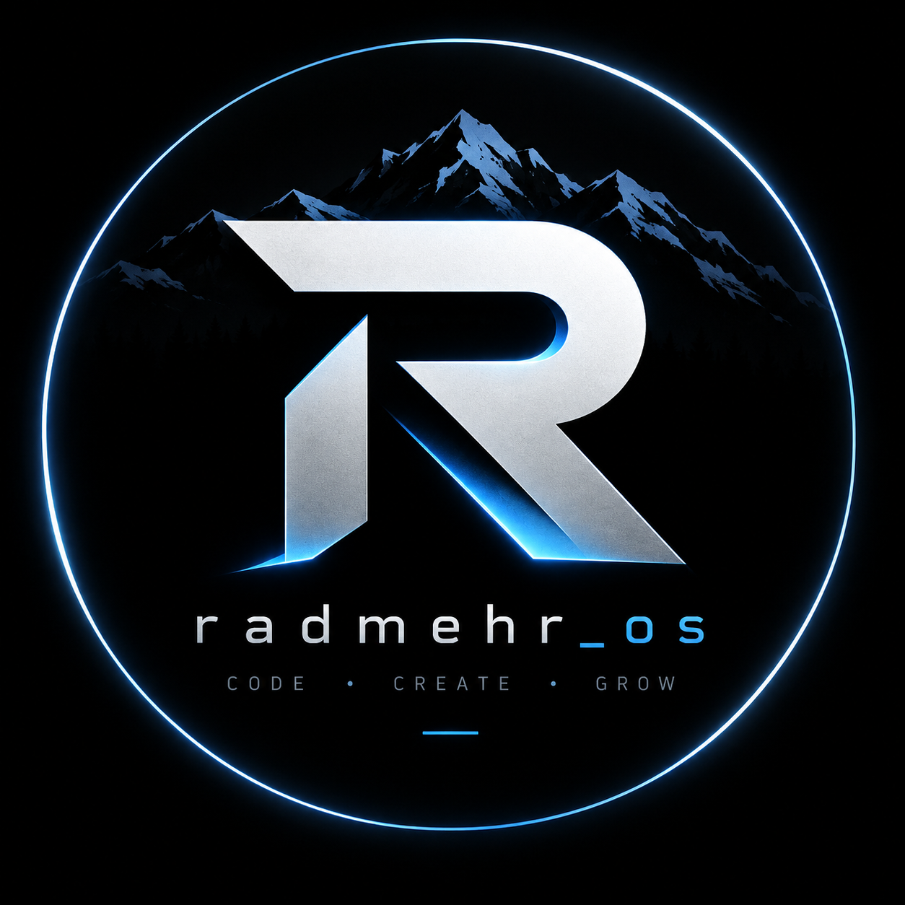

<p align="center">
  
</p>

<h1 align="center">🚀 Radmehr OS</h1>

<p align="center">
  <b>A modular command-line operating system simulator built with Python</b>
</p>

<p align="center">
  Build • Learn • Explore • Automate
</p>

---

## 📖 About

**Radmehr OS** is a modular command-line operating system simulator built with Python.

The project started as a way to learn Python by building a real-world application **one module at a time**.

Radmehr OS combines multiple modules including **Artificial Intelligence, NASA Space tools, Games, Utilities, Settings, and automated GitHub backup**.

🚧 The project is actively under development, with new features being added continuously.

---

## ✨ Features

### 🤖 AI Module

* Gemini AI integration
* Interactive AI chat
* API key management

---

### 🌌 Space Module

* NASA Astronomy Picture of the Day (APOD)
* Open NASA images in the browser
* Display image titles
* Display NASA explanations
* ISS Live Tracker

---

### 🛠️ Tools Module

* Calculator
* Utility tools
* Expandable tool system
* Designed for adding new utilities over time

---

### 🎮 Games Module

* Terminal-based games
* Expandable game system
* Designed for adding new games

---

### ⚙️ Settings Module

* Change username
* Update Gemini API key
* Update NASA API key
* Run GitHub backup
* View backup information
* Manage Radmehr OS settings

---

## 💾 GitHub Backup Module

Radmehr OS includes a built-in GitHub backup system for managing project backups.

It can:

* 🔍 Detect project changes automatically
* ➕ Add modified files to Git
* 📝 Create Git commits
* 🔄 Synchronize with GitHub using rebase
* 🚀 Push changes to the remote repository
* ⏭️ Skip the backup process when there are no changes

This module also makes Git and GitHub part of the programming experience.

---

## 📂 Project Structure

```text
radmehr_os/
│
├── radmehr_os.py
├── ai.py
├── space.py
├── games.py
├── tools.py
├── settings.py
├── github_backup.py
├── requirements.txt
├── .gitignore
└── README.md
```

The project is organized into separate modules so that each part can be developed independently.

---

## 🔐 Private Files

The following files may contain private information and are intentionally excluded from Git:

```text
api_key_radmehr_os.txt
nasa_api_key.txt
name_radmehr_os.txt
.env
```

These files should remain on the local computer and **must never be committed to a public repository**.

> 🔒 Never publish API keys, passwords, access tokens, or other secrets.

---

## 🛠️ Technologies

* 🐍 Python
* 🤖 Google Gemini API
* 🌌 NASA API
* 🔀 Git
* 🐙 GitHub
* 📡 REST APIs
* 💻 Command-line interface

---

## 🚀 Installation

### 1. Clone the repository

```bash
git clone https://github.com/radmehrfarhadi/radmehr_os.git
```

### 2. Enter the project directory

```bash
cd radmehr_os
```

### 3. Install dependencies

```bash
pip install -r radmehr_os/requirements.txt
```

### 4. Run Radmehr OS

```bash
python radmehr_os/radmehr_os.py
```

---

## 📦 Requirements

Project dependencies are managed through:

```bash
pip install -r radmehr_os/requirements.txt
```

Current dependencies include:

* `requests`
* `google-genai`
* `bcrypt`

> Python standard-library modules do not need to be added to `requirements.txt`.

---

## 🗺️ Roadmap

### ✅ Completed

* [x] Gemini AI
* [x] NASA APOD
* [x] Settings Module
* [x] GitHub Backup
* [x] Modular project structure
* [x] ISS Live Tracker
* [x] Calculator

### ⏳ Planned

* [ ] Weather Module
* [ ] Voice Assistant
* [ ] File Manager
* [ ] GUI Version
* [ ] Android Version
* [ ] Plugin System

---

## 🔏 Code signing policy

Free code signing provided by SignPath.io, certificate by SignPath Foundation.

### Team roles

* **Committer and reviewer:** [Radmehr Farhadi](https://github.com/radmehrfarhadi)
* **Approver:** [Radmehr Farhadi](https://github.com/radmehrfarhadi)

### Privacy

Radmehr OS may connect to third-party network services only when the user explicitly uses features that require them, including Google Gemini, NASA APIs, and GitHub backup/synchronization. The project does not intentionally transfer information to other networked systems unless specifically requested by the user or required for a user-invoked feature.

Users of network-dependent features are also subject to the privacy policies and terms of the corresponding third-party services.

---

## 🤝 Contributing

Suggestions, bug reports, and pull requests are welcome.

You can:

* ⭐ Star the project
* 🐛 Report bugs
* 💡 Suggest new features
* 🍴 Fork the repository
* 🔧 Submit improvements

---

## 👨‍💻 Author

**Radmehr Farhadi**

🐙 GitHub: [@radmehrfarhadi](https://github.com/radmehrfarhadi)

🌐 Website: [radmehr-farhadi.ir](https://radmehr-farhadi.ir/)

---

⭐ If you like this project, consider giving it a Star.

**Made with ❤️ using Python.**

> **Learn → Build → Debug → Improve 🚀**
